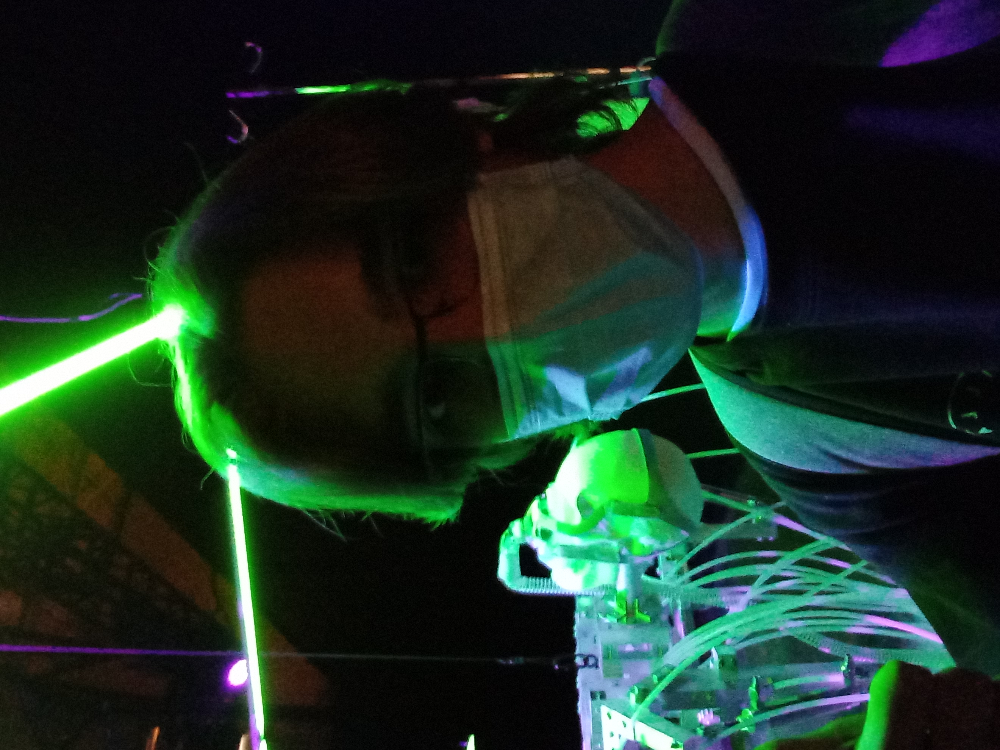
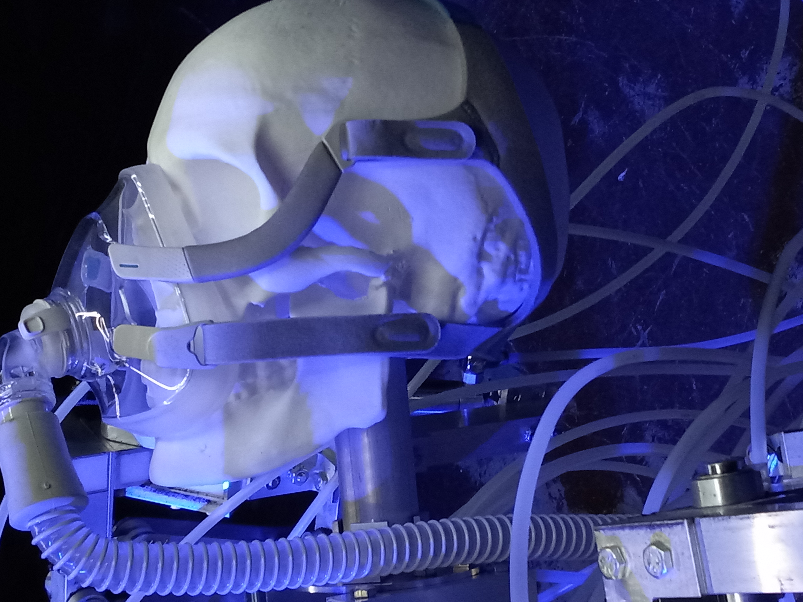
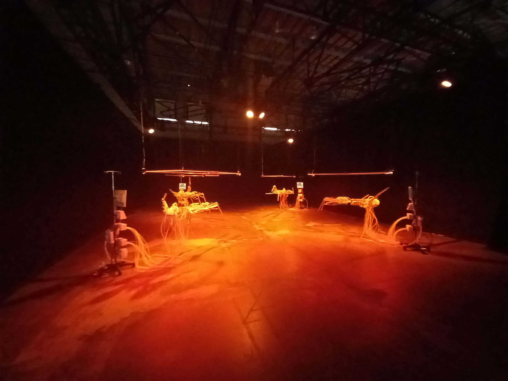
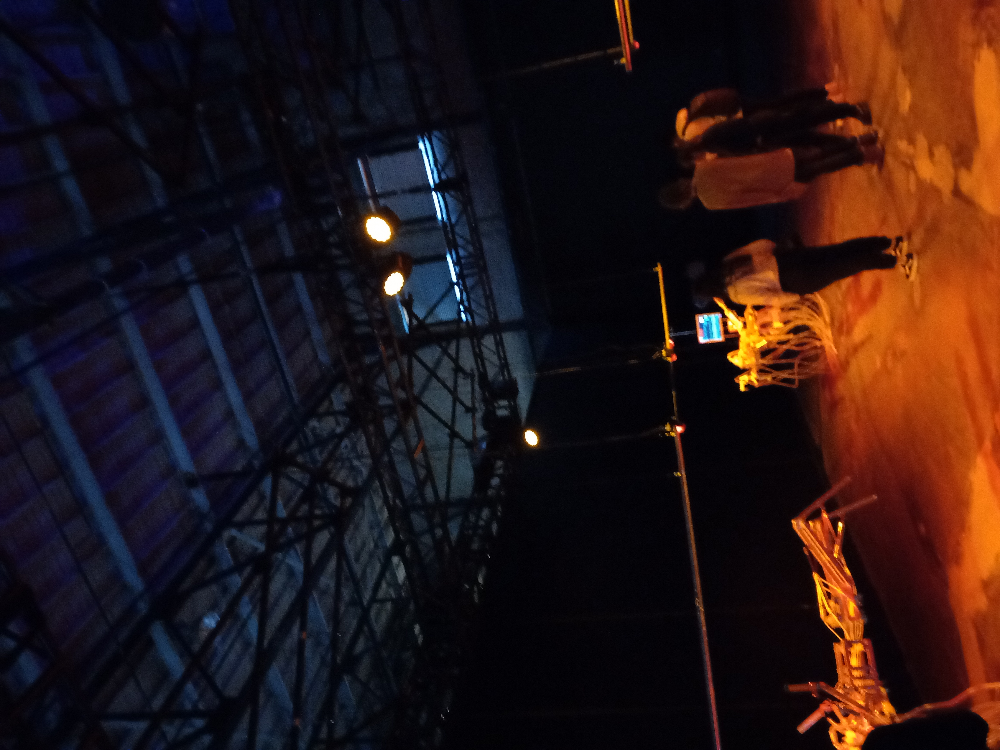

# Fiche technique I.C.U

### Titre de l'oeuvre ou de la réalisation:
I.C.U (intensive care unit) 

### Nom de l'artiste ou de la firme:
Bill Morin, né a Montréal (Québec, Canada).

### Année de réalisation:
2021

### Nom de l'exposition ou de l'événement:
Biennal international d'art numérique. 

### Lieu de mise en exposition:
2020 Rue William, Montréal, QC

### Date de votre visite:
9 Février 2022

### Description de l'oeuvre ou du dispositif multimédia:
Robot en tige de métal qui forme un squelette, avec un crâne humain en plastique a la place de sa tête. Sur la tête il y a un apareil d'assistance respiratoire.
Les membres du corps son rattacher a plusieur cable relier au circuit qui contrôle les mouvements du squelette. Les squelettes symbolises des patients en soins intensif.
D'ou son nom, "intensive care unit".

### Explications sur la mise en espace de l'oeuvre ou du dispositif:

Les quatres squelette sont disposé également par rapport au milieu de la pièce, en entrant dans le côté droit de la pièce il y a un rideau avec l'ordinateur de contrôle

### Liste des composantes et techniques de l'oeuvre ou du dispositif:
* 8 projecteur de lumière rouge qui change au bleu, vice versa.
* 2 haut-parleur 
* 4 rectangle lumineux de lumière blanche (qui flash) alternant au bleu et au vert.
* 4 squelette en acier 

### Liste des éléments nécessaires pour la mise en exposition:
* Cable donnant du courant au oeuvre
* Ordinateur de contrôle
* Cage supportant au plafond les lumière et haut-parleur.

### Expérience vécue :

Description de votre expérience de l'oeuvre ou du dispositif, de l'interactivité, des gestes à poser, etc.

### ❤️Ce qui vous a plu, vous a donné des idées et justifications
J'ai beaucoup aimé le fait que tous les cables et panneau de contrôle soient mise en valeur. La disposition des éléments faisait en sorte qu'on se croyait presque dans une vrai unité de soin intensif.

### 🤔Aspect que vous ne souhaiteriez pas retenir pour vos propres créations ou que vous feriez autrement et justifications
Le seul aspect que j'ai moin aimé est que parfois la salle devenait presque complètement noir pendant un bon moment. C'est surement un choix artistique de l'artiste, mais j'ai moin aimé cette partie.

Références
https://www.elektramontreal.ca/bian2021-billvorn

