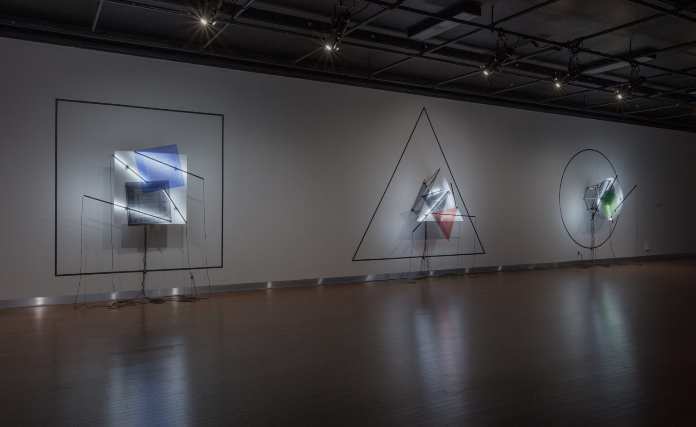
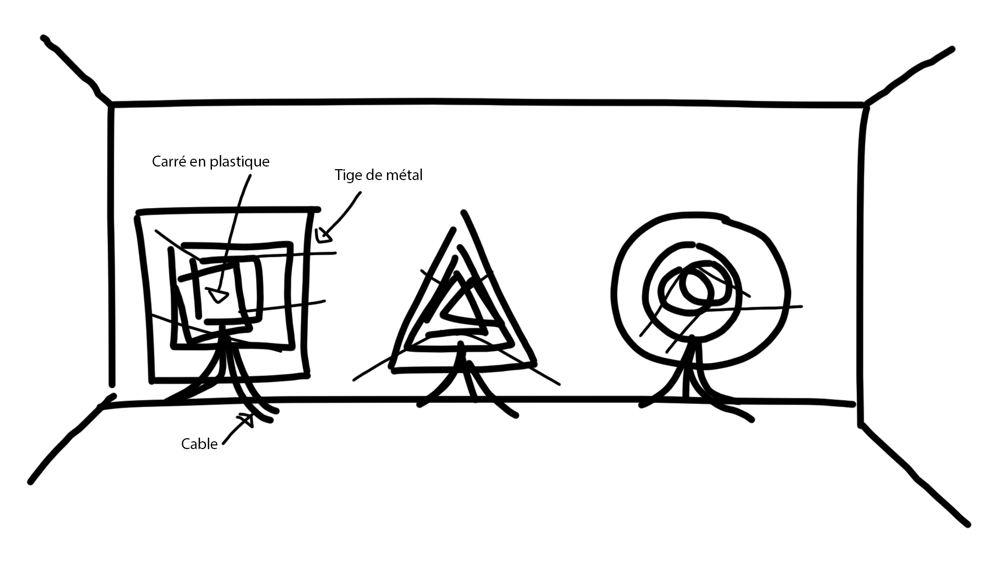
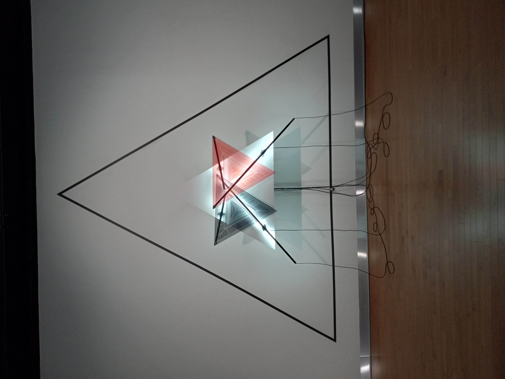
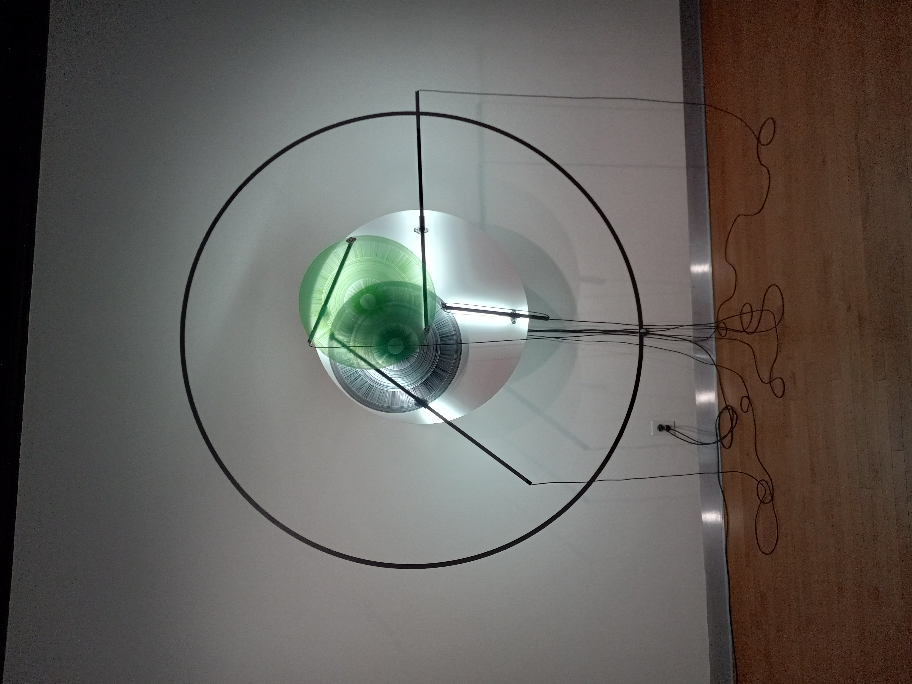

# Titre de l'oeuvre ou de la réalisation
## Mécanismes de dessaisissement

## Nom de l'artiste ou de la firme :
Béchard Hudon
## Année de réalisation :
2022
## Nom de l'exposition ou de l'événement :
Configuration du sensible.
## Lieu de mise en exposition :
Salle Alfred Pellan de la Maison des arts de Laval, Laval
## Date de votre visite :
9 mars 2022
## Description de l'oeuvre ou du dispositif multimédia :

## Explications sur la mise en espace de l'oeuvre ou du dispositif :

## Liste des composantes et techniques de l'oeuvre ou du dispositif :
* projecteurs
* tige de métal avec lumière rattacher a eux
* formes en acrylique (carré, cercle, triangle)
* ruban sur les murs
## Liste des éléments nécessaires pour la mise en exposition 
* cadre en métal soutenant les oeuvre 
## Expérience vécue:
J'ai bien aimé l'expérience je trouvais l'oeuvre captivante j'avais l'impression qu'elle nous emportais.
## Description de mon expérience de l'oeuvre.
Il n'y a pas vraiment d'intéractivité, c'est plutôt une oeuvre comptemplative.
## ❤️ Ce qui ma plu, ma a donné des idées et justifications
Je revien sur le point mentionner plus tôt, l'oeuvre nous hypnotise, elle nous garde intéressé je trouve qu'ils on bie réussi sur ce point là. J'aimerasi réaliser une oeuvre capable de garder l'attention de gens.
## 🤔 Aspect que vous ne souhaiteriez pas retenir pour vos propres créations ou que vous feriez autrement et justifications
La durée de la rotation complète des oeuvres est un peu longue, je réduirais un peu.
## Références
https://bechardhudon.com/project/configurations-du-sensible-2022/
