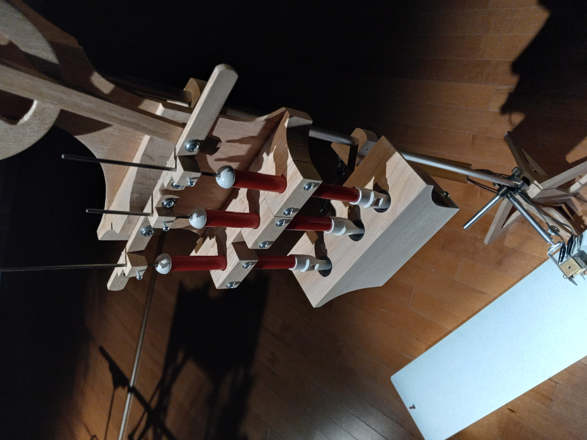
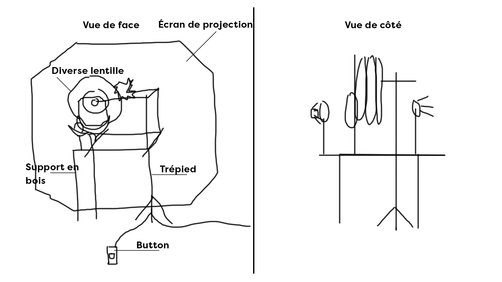

# Titre de l'oeuvre ou de la réalisation
## Souffles

## Nom de l'artiste ou de la firme
Manon Labrecque.
## Année de réalisation
 2022.
## Nom de l'exposition ou de l'événement
Des [ré]animations.
## Lieu de mise en exposition
Salle Alfred-Pellan, Maison des arts de Laval.
## Date de visite
Mercredi 4 mai
## Description de l'oeuvre ou du dispositif multimédia 

### Cartel
Par la création de divers mécanismes motorisés générant des séquences d'images en mouvement et des sons, par des interventions dessinées au mur et sur papier, par la projection d'images vidéo : un espace-temps se déploie pour apprivoiser les mouvements parfois impétueux de l'existence et les forces incontrôlables qui nous habitent. D'étranges rituels pour réanimer la vie qui s'est éteinte en soi... et pour honorer la puissance de vie qui est en soi

### Description physique de l'oeuvre
Plusieurs lentilles de diverse forme et motif aligner l'une a la suite de l'autre. Une lumiere les traverse pour projeter une scène sur le mur. L'oeuvre est accompagner de musique. Cette musique qui est représenter par des bruits de sifflet et des percussion sur une plaque d'acier. 

## Explications sur la mise en espace de l'oeuvre ou du dispositif
L'oeuvre est disposé dans le fond de la pièce. 

## Liste des composantes et techniques de l'oeuvre ou du dispositif 
* moteurs 
* souffleurs
* flûtes
* lentilles
* DEL
* tôle galvanisée
## Liste des éléments nécessaires pour la mise en exposition
* trépied
* circuit électronique
## Expérience vécue:
## Description de votre expérience de l'oeuvre ou du dispositif, de l'interactivité, des gestes à poser, etc.
## ❤️ Ce qui vous a plu, vous a donné des idées et justifications
## 🤔 Aspect que vous ne souhaiteriez pas retenir pour vos propres créations ou que vous feriez autrement et justifications
## Références

