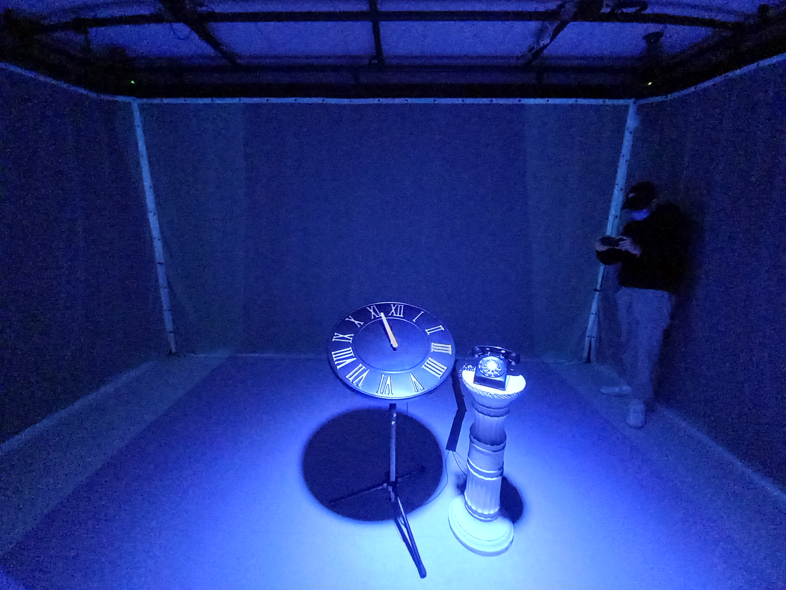
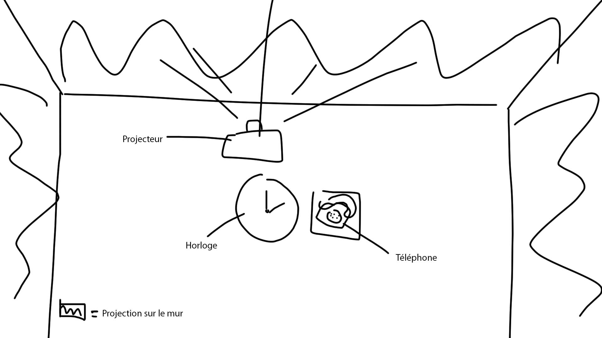
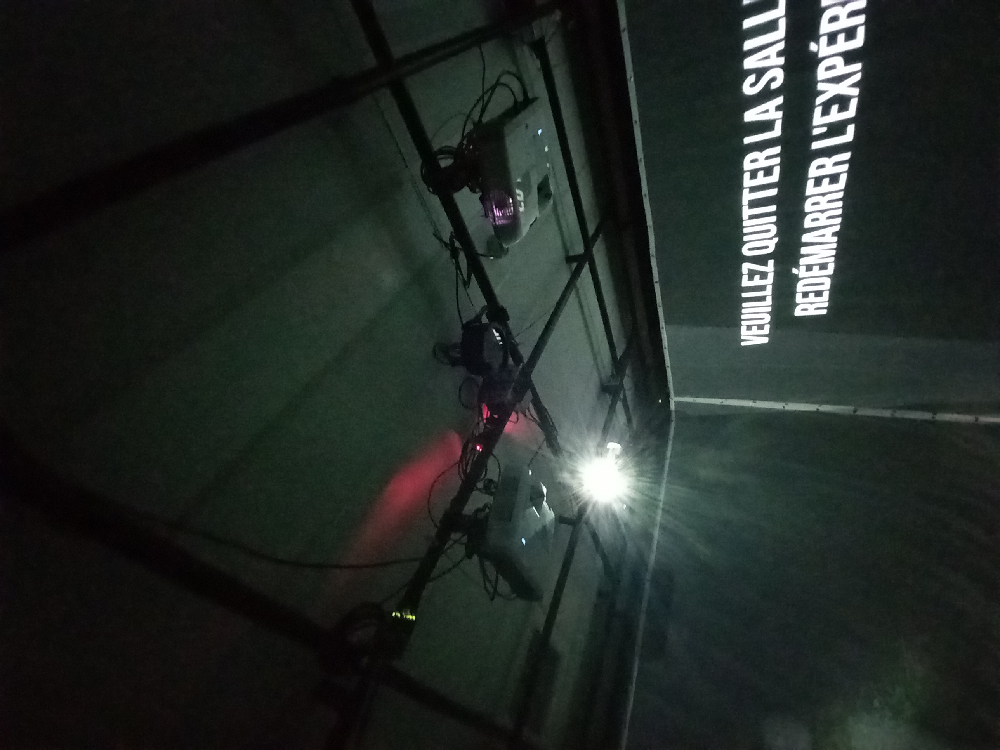

# Titre de l'oeuvre ou de la réalisation
## L'Horloge de l'apocalypse

## Nom des artistes :
Maxime Sabourin, Louis-Philippe Gravel, Alexis Lacasse, Tristan Girard-Montpetit, Maxime De Falco.
## Année de réalisation :
2022
## Nom de l'exposition ou de l'événement :
Moebius.
## Lieu de mise en exposition :
Grand studio, Collège Montmorency, Laval.
## Date de votre visite :
23 mars 2022
## Description de l'oeuvre ou du dispositif multimédia :
L'Horloge de l'apocalypse, représente les heures face a la priode actuelle. Par exmemple selon l'horloge, on serait a eviron 11h58, soit 2 minutes avant la destruction du monde. L'oeuvre nous sensibilise face a l'Apocalypse imminente.
## Explications sur la mise en espace de l'oeuvre ou du dispositif :

## Liste des composantes et techniques de l'oeuvre ou du dispositif :
* 3 projecteurs
* rideau de plastique pour projection
* téléphone
* piédestale
* horloge

## Liste des éléments nécessaires pour la mise en exposition 
* cadre en métal au plafond pour retenir les projecteurs
* trépied pour soutenir l'horloge
## Expérience vécue:
J'ai bien aimé l'expérience je trouve que l'oeuvre démontrais bien a quel point on ne prend pas soin de la terre et que sa doit changer au plus vite sinon les consquences seront irréversible.
## Description de mon expérience de l'oeuvre.
J'ai trouver ça ingénieux de faire tourner l'horloge afin de faire avancer les époques.
## ❤️ Ce qui ma plu, ma a donné des idées et justifications
Beaucoup d'effort a été mis dans ce projet, un de mes aspects préféré est la musique, qui suis le thème dechacun des décors.
## 🤔 Aspect que vous ne souhaiteriez pas retenir pour vos propres créations ou que vous feriez autrement et justifications
Les décors étaits bien réalisé mais je trouve que les animations aurais pû être un peu plus complexe.
## Références
https://tim-montmorency.com/2022/projets/L-horloge-de-l-apocalypse/docs/web/index.html
